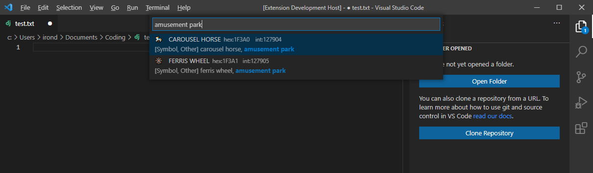
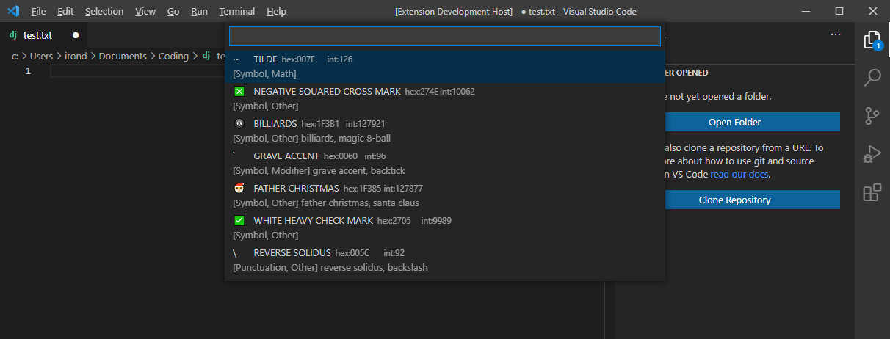

# Unicode Palette

A character palette for searching for and inserting unicode characters in VS Code. Useful for symbols, emoji and other characters that you might not have on your keyboard.

Includes searching by unicode published character aliases and categories.

Access the extension via `Ctrl + Shift + P` or `View` > `Command Palette...` > `Insert Characters`.

## Features

Search for characters by the official name, code, category or any unicode provided aliases.

Your most recently used characters will be shown on opening the palette.

## Known Issues

Recently used characters will show up twice if you type and search for them.

## Release Notes

### 1.0.0

-   Initial release of UnicodePalette

### 1.0.1

-   Fixed typo in README

### 1.0.2

-   Fixed typo
-   Published extension on Open VSX Registry
-   Updated third party libraries

### 1.0.3

-   Updated data to Unicode 14

### 1.0.4

-   Reverted attempt to minify javascript

## Other Notes

Unicode data based on version 14.0.0.

Excluded Unicode General Categories:

-   Letter, Other
-   Other, Private Use
-   Other, Not Assigned
